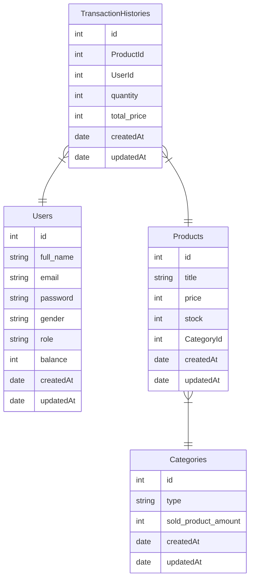

# hacktiv8-project3

### ERD



## DOCUMENTATION RESTFULL API

<p> Dokumentasi untuk RESTFULL API project 3 - Hacktiv8 Toko Belanja </p>

<p> Project ini digunakan sebagai syarat memenuhi kebutuhan akademik pada program MSIB kampus merdeka dengan mitra Hacktiv8 </p>

## CLONE REPOSITORY

```bash
$ git clone <remote_repo> (ex: git clone https://github.com/faruqAbdulHakim/hacktiv8-project3)
```

## HOW TO RUN

```bash
$ npm install (to install dependencies on the project stored in package.json)
# step pertama : rename .env.example to .env
# step kedua : konfigrasi file .env isi PORT dan SECRET_TOKEN
# step ketiga : konfigurasi direktori config dan sesuaikan dengan konfigurasi postgre pada device masing-masing
```

## HOW TO SETUPDATABASE

<p>Buat database postgre menggunakan ORM Sequelize</p>

```bash
$ npx sequelize db:create (to create database)
```

```bash
$ npx sequelize db:migrate (to migration table on database)
```

```bash
$ npx sequelize db:seed (to seeding value on database)
```

| name                     | docs                                                |
| ------------------------ | --------------------------------------------------- |
| USERS DOCS               | [Users](./docs/users.md)                            |
| CATEGORY DOCS            | [Category](./docs/category.md)                      |
| PRODUCTS DOCS            | [Products](./docs/products.md)                      |
| TRANSACTION HISTORY DOCS | [Transaktion History](./docs/transactionHistory.md) |

## LINK DEPLOYMENT

```bash
https://tokobelanja-restfull-api.up.railway.app/
```
